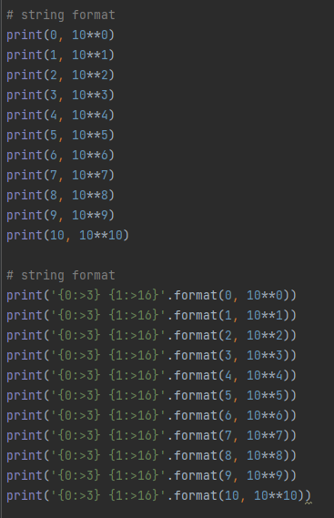
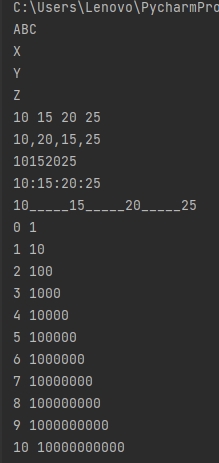
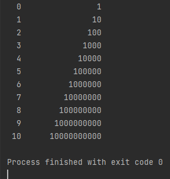
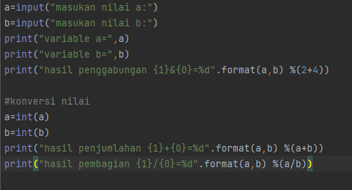
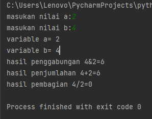
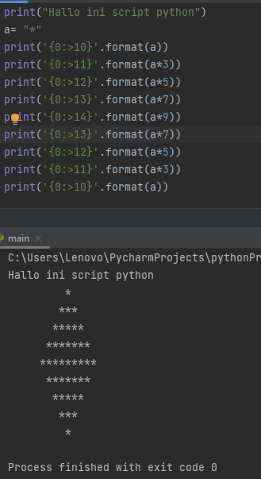
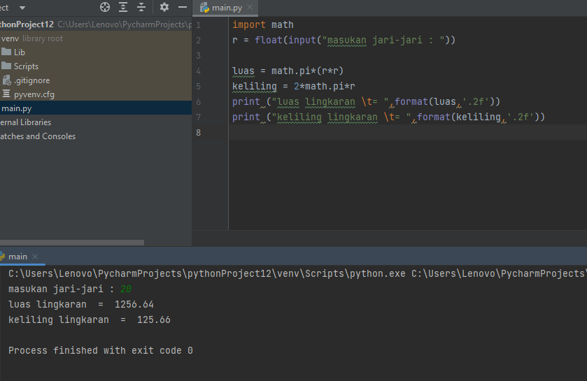

### Nama : Uswatun Hasanah

## Nim   : 312210343

## Kelas : TI.22.A.3

### PRAKTIKUM3

## Latihan1
## Ketik rumus END yang di ecampus



## String Format


## Hasil Latihan 1





## Latihan 2
## Rumus variable
 
 

### Hasil latihan 2



### Latihan 3

Menggunakan string format untuk membuat
belah ketupat



### Latihan 4

## Luas Lingkaran

## Flowchart untuk mencari lingkaran


## Membuat program untuk menghitung luas lingkaran

Rumuas luas lingkaran yaitu 

```
 Phi r r 
```

## Mengimput suatu nilai jari-jari

untuk mencari luas lingkaran

```
r = int(input('masukan jari-jari lingkaran')
```

## Menghitung suatu nilai jari-jari

untuk mencari luas lingkaran

```
r = int(input('masukan jari-jari lingkaran: '))
```

## Mendeklarasikan nilai Phi

```
L = phi * (r * r)
```

## Mencetak hasil 

