### Nama : Uswatun Hasanah

## Nim   : 312210343

## Kelas : TI.22.A.3

### PRAKTIKUM3

## Latihan1
## Penggunaan END

dalam fungsi cetak digunakan untuk menambahkan string. diakhir outputnya (end=") melewati melewati spasi ke parameter menunjukan bahwa karakter
akhir harus diidentifikasikan oleh spasi

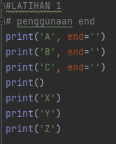

## Penggunaan separator

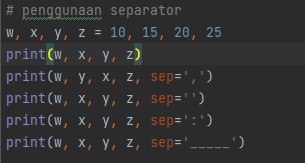

## String Format

Format string kemungkinan memasukan item
kedalam string dari pada menggabungkan
string menggunakan (,) / string contatenation

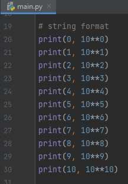

## String Format 2

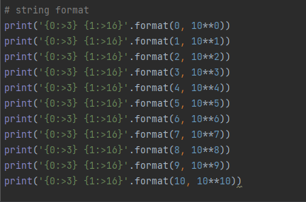

## Hasil Latihan 1

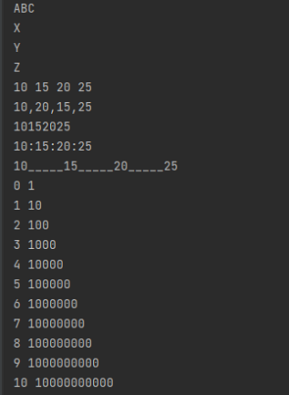

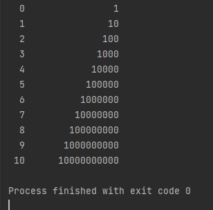

## Latihan 2
 Input Variable

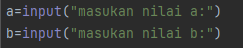

## Mencetak Variable

Mencetak variable ketika sudah diinput 

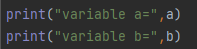

## Penggabungan Variable

Penggabungan antara dua variable

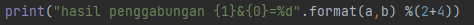

## Input dan konversi nilai variable 2

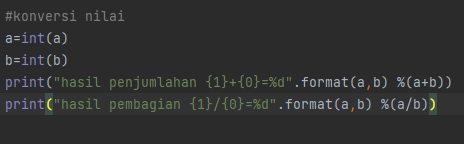

### Hasil latihan 2

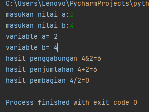

### Latihan 3

Menggunakan string format untuk membuat
belah ketupat

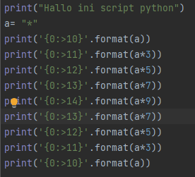

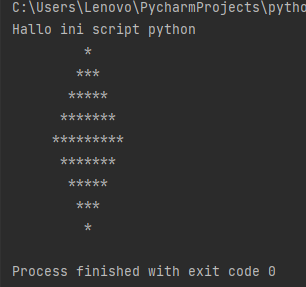

### Latihan 4

## Luas Lingkaran

## Flowchart untuk mencari lingkaran

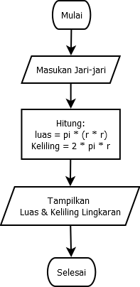

## Membuat program untuk menghitung luas lingkaran

Rumuas luas lingkaran yaitu : Phi r r 

## Mengimput suatu nilai jari-jari

untuk mencari luas lingkaran 
r = int(input('masukan jari-jari lingkaran')

## Menghitung suatu nilai jari-jari

untuk mencari luas lingkaran
r = int(input('masukan jari-jari lingkaran: '))

## Mendeklarasikan nilai Phi

L = phi * (r * r)

## Mencetak hasil 

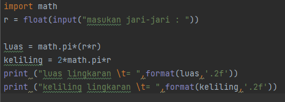

## Hasil luas lingkaran

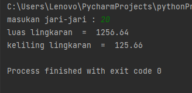